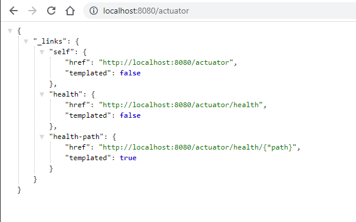
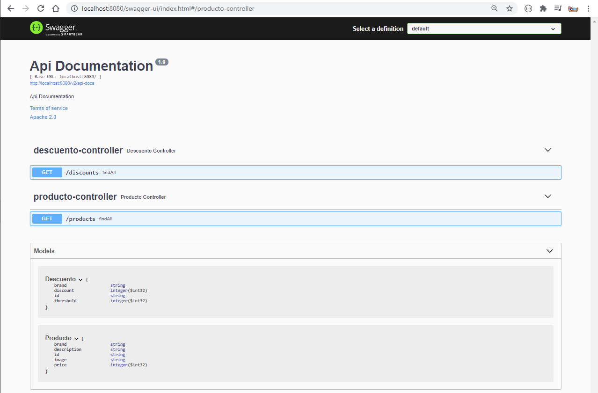

# Carrito Compra Backend

## Development and Deploying for project SpringBoot

* abrir consola de comando

```bash
docker network create mongodb

docker run --rm --name mongodb -p 27017:27017 mongodb
```


* abrir consola de comando

```bash
mvn clean -DskipTests package

java -Dspring.profiles.active=dev -jar target/carrito-compra-backend-0.0.1-SNAPSHOT.jar
```

## Containerising the app carrito compra backend

```bash
docker network create mongodb

cd carrito-compra-database

docker build --rm -t mongodb .

docker run --rm --name mongodb --net mongodb mongodb

# -----------------------

cd carrito-compra-backend

docker rm carrito-compra-backend

docker build --rm -t carrito-compra-backend .

docker run --rm --name carrito-compra-backend --net mongodb carrito-compra-backend
```

## visiting actuactor

http://localhost:8080/actuator





## Api Documentation

http://localhost:2836/swagger-ui/index.html



