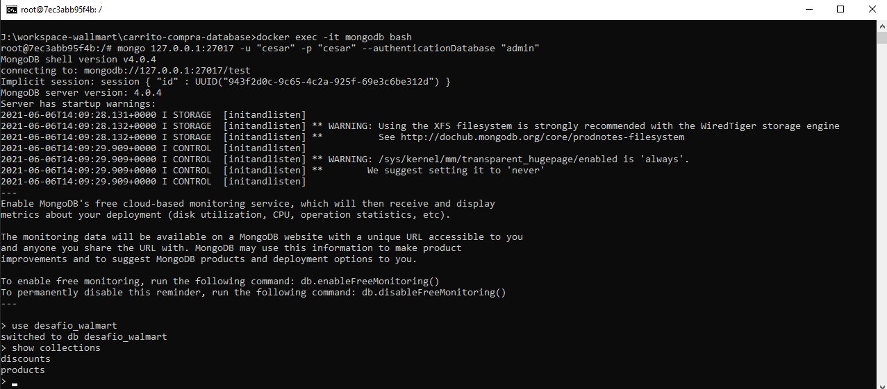

# Carrito Compra Database

## ## Containerising the image database mongodb

* abrir consola de comando

```bash
docker build -t mongodb .

docker run --rm --name mongodb mongodb
```



* abrir consola de comando

```bash
docker exec -it mongodb bash

mongo 127.0.0.1:27017 -u "cesar" -p "cesar" --authenticationDatabase "admin"

use desafio_walmart

show collections
```

